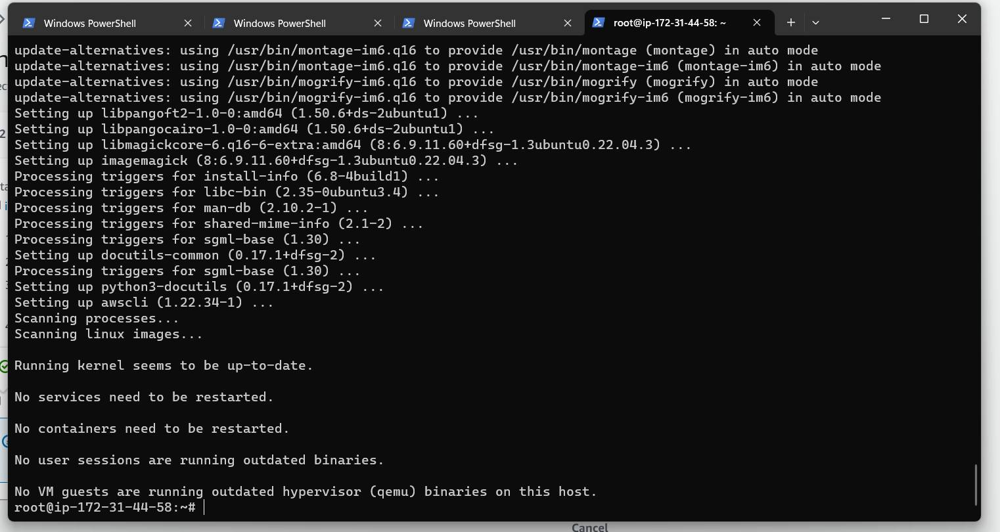

# AWS-Cloud-for-Web-App-Setup-Lift-and-Shift
## This project is to run application workload on AWS using lift and shift strategy

### First creat security group for Load Balancer

### creating security group for Tomcat Instance will run on port 8080 and allow traffic only on Load Balancer and 22 from MyIp also 8080 from MyIP

### Creating another security group for all backend services(Mysql,Memcache,Rabbit MQ) runing on port 3306,11211 and 5672 respectivelty and allowing traffic from application server(Tomcat Instance)

### Creating the last security group in the backend service to allow services in the group interacte with each other and also allow runing on port 22 from My IP

### Creating key pairs

### Next step is to lunch instance (CentOS) and copying the source code from the Mysql to the user data section in the advance details making sure the security group is backend

### To retrieve user data from within a running instance, use the following URI.

`http://169.254.169.254/latest/user-data`

### verifying database

`mysql -u admin -padmin123 accounts`

`show tables`

### Verifying memcahe server

`ss -tunlp | grep 11211`

### Verifying RabbitMq Server

`systemctl status rabbitmq-server`

### Verifying Tomcat9

`systemctl status tomcat9`

### Creating host zone on Route 53 allocating all backend servers with their IP 

address

## Build and Deploy Artifact

### Before build the Artifact we will make change to the application properties in the source code for backend to be the same as the IP in Route 53

### Build Artifact

`mvn install`

### Pushimg the Artifact to s3 bucket, but we will need authantication thru iAm user
### creating iAM USER

### We will use the acess key to acess s3 bucket

`aws s3 mb s3://lift-shift-artifact`

### Copying the artifact to the s3 bucket

`aws s3 cp target/vprofile-v2.war s3://lift-shift-artifact`

### Creating Roles and attached to EC2 instance(App01 server) instead of access keys, we are giving roles to the instance

### Login into the App01(Tomcat) instance

`apt update`

`apt install awscli -y`

### Confirm awscli has been install

`aws s3 ls`

### Copy the artifact to tMP folder

` aws s3 cp s3://lift-shift-artifact/vprofile-v2.war /tmp`

### To deploy we have to stop the Tomcat9 service and remove the default application /var/lib/tomcat9/webapps/ROOT 

`systemctl stop tomcat9`

`rm -rf /var/lib/tomcat9/webapps/ROOT`

### Copy artifact from tmp/ to /var/lib/tomcat9/webapps/ROOT.war

`cp /tmp/vprofile-v2.war /var/lib/tomcat9/webapps/ROOT.war`

### Validation

`cat /var/lib/tomcat9/webapps/ROOT/WEB-INF/classes/application.properties`

## Setting up a Load Balancer

### Crrating application Load Balancer from Target Group
### create target group and create the load balancer making sure to add your certificate

### Validate to make sure it is pointing to the endpoint of the load balancer and load balancer routed toward Tomcat, the page is coming from Tomcat 

## Setting up Autoscaling group for application server(Tomcat ec2 instance)

The End

